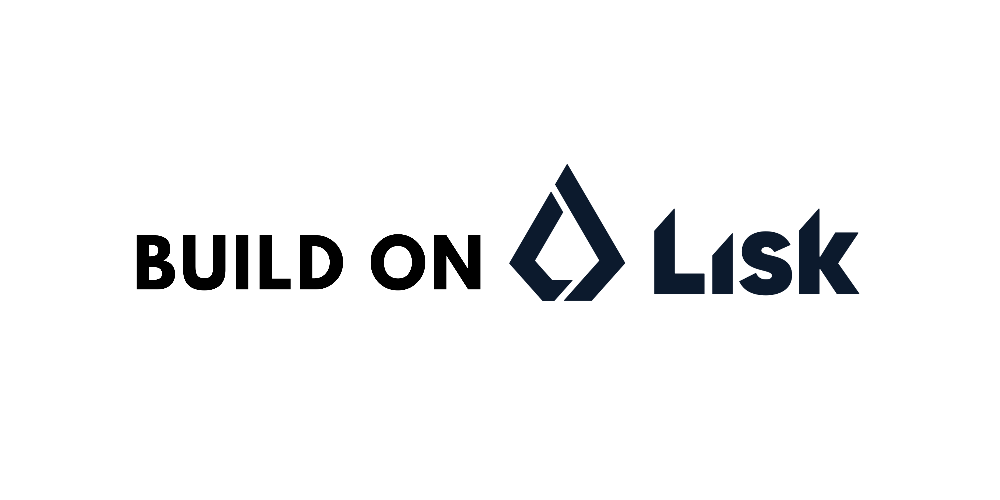

# AgentFlow


AgentFlow adalah platform manajemen AI Agent terintegrasi blockchain yang memungkinkan pembuatan, pengelolaan, dan deployment AI agent secara terdesentralisasi. Platform ini mendukung integrasi dengan AI providers seperti OpenAI dan Google Gemini, serta menggunakan smart contract di blockchain (Lisk/EVM) untuk transparansi dan keamanan data agent.

---

## ✨ Fitur Utama

- **Manajemen AI Agent**: Buat, konfigurasi, dan kelola agent AI dengan personality unik.
- **Integrasi AI**: Mendukung OpenAI (GPT-3.5, GPT-4) & Google Gemini, user dapat input API key sendiri.
- **Integrasi Blockchain**: Agent didaftarkan di blockchain menggunakan smart contract (MetaMask, Lisk).
- **Embed & Integrasi**: Sediakan kode embed (iframe/widget/React) untuk integrasi ke website lain.
- **Analytics & Monitoring**: Statistik penggunaan, performa, dan monitoring chat agent.
- **Keamanan & Transparansi**: Semua agent tercatat di blockchain, hanya owner yang bisa mengelola agent-nya.

---

## 👨‍💻 Tim Pengembang

- **I PUTU RIO KURNIAWAN** – Fullstack Web
- **Risky Juniardi** – Fullstack Web 

## 🏗️ Arsitektur

### 1. Frontend + Backend (Monorepo Next.js)
```
frontend + backend/
├── app/
│   ├── agents/           # Manajemen agent
│   ├── analytics/        # Statistik & monitoring
│   ├── api/chat/         # Endpoint chat AI
│   ├── billing/          # Manajemen billing
│   ├── chat/             # Testing agent
│   ├── create-agent/     # Form pembuatan agent
│   ├── dashboard/        # Dashboard utama
│   ├── embed/            # Widget/embed agent
│   └── profile/          # Profil user
├── components/           # Komponen UI (shadcn/ui, Radix, custom)
├── hooks/                # Custom React hooks
├── lib/                  # Service layer (AI, blockchain, store)
├── public/               # Static assets
├── styles/               # Styling (Tailwind)
├── package.json          # Dependensi utama (Next.js, React, OpenAI, Gemini, wagmi, RainbowKit, Zustand, dsb)
```

### 2. Smart Contract (Solidity, Hardhat)
```
smartcontract/
├── contracts/
│   └── AgentRegistry.sol # Smart contract utama untuk registry agent
├── scripts/              # Script deploy & utilitas
├── deployment-info.json  # Info deployment contract
├── hardhat.config.ts     # Konfigurasi Hardhat
├── package.json          # Dependensi blockchain (Hardhat, OpenZeppelin)
```

---

## 🔗 Integrasi Blockchain

- **Smart Contract: AgentRegistry**
  - Setiap agent didaftarkan di blockchain dengan data: owner, nama, hash detail (off-chain), tipe agent, status aktif.
  - Fungsi utama:
    - `createAgent(name, hash, agentType)`: Mendaftarkan agent baru.
    - `getMyAgents()`: Mendapatkan daftar agent milik user.
    - `getAgent(id)`: Mendapatkan detail agent berdasarkan ID.
  - Semua interaksi agent (create, update, query) tercatat di blockchain untuk transparansi & keamanan.

- **Wallet Integration**
  - Mendukung MetaMask untuk sign & verifikasi kepemilikan agent.
  - Address user digunakan sebagai identitas utama di blockchain.

---

## 🤖 Integrasi AI

- **Provider**: OpenAI (GPT-3.5, GPT-4, dst), Google Gemini (Gemini 1.5, 2.0 Flash, dst)
- **Fitur**:
  - User bisa input API key sendiri.
  - Pilihan model, parameter (temperature, max tokens).
  - Validasi API key & fallback mode jika key tidak tersedia.
  - Chat endpoint terintegrasi langsung dengan smart contract (agent yang aktif di blockchain).

---

## 📦 Teknologi

- **Frontend**: Next.js 14, React 18, TypeScript, Tailwind CSS, shadcn/ui, Zustand
- **AI Integration**: OpenAI SDK, Google Generative AI SDK
- **Blockchain**: Solidity, Hardhat, MetaMask, wagmi, RainbowKit, Lisk/EVM
- **UI Components**: Radix UI, Lucide Icons

---

## 🚀 Cara Menjalankan

### Prasyarat
- Node.js 18+
- pnpm atau npm
- MetaMask wallet
- Koneksi ke jaringan Lisk/EVM

### Instalasi & Development
```bash
pnpm install
pnpm dev
```
Atau gunakan npm jika tidak ada pnpm.

### Build & Production
```bash
pnpm build
pnpm start
```

### Deploy Smart Contract
```bash
cd smartcontract
npm install
npx hardhat compile
npx hardhat run scripts/deploy.ts --network <network>
```

---

## 📄 Lisensi

MIT License 

---

